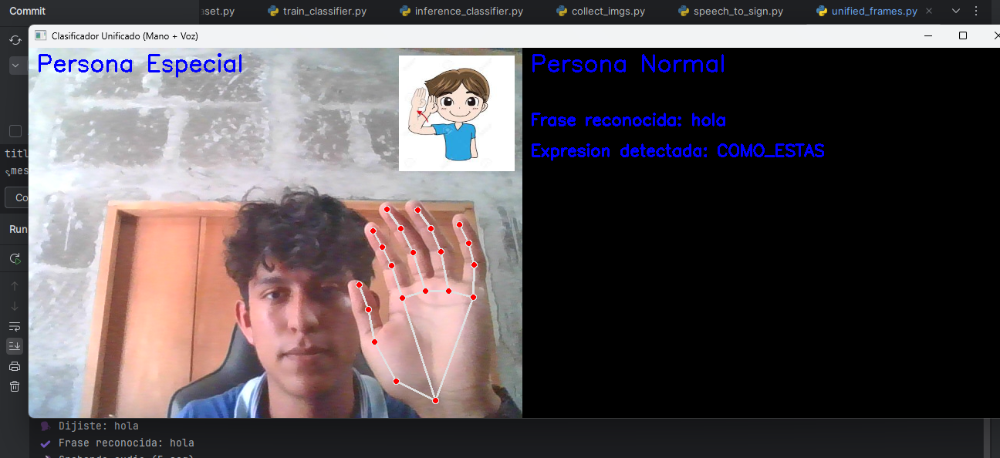

# 🖐 Sign Language Detector

This project is a **sign language detector** that combines computer vision and voice recognition to facilitate communication between people with hearing impairments and hearing individuals.

---

## 📚 Description

The program has **two main frames**, representing two sides of the conversation:

✅ **For the person with hearing impairment (special person):**  
Using a webcam, the system recognizes the performed sign and translates it into the corresponding letter or expression.

✅ **For the hearing person (normal person):**  
Through voice recognition, the system detects what the person says and displays an image of the corresponding sign, allowing the special person to understand the message.

---

## 🎯 Purpose

This project was presented at the **Math Fair** of the **National University of Engineering (UNI), Juigalpa Regional Center** on **May 10, 2025**.  
Now it is part of the **#ForTheLoveOfCode** hackathon organized by **GitHub**.

Its goal is to demonstrate how mathematics is essential to the development of artificial intelligence, and how this knowledge can be applied to solve real-world problems and generate a positive impact in society.  
We aim to implement this project to address **real-world challenges** and improve inclusive communication.

---

## ⚙️ How it works

The project is developed in **several stages** through different scripts:

1️⃣ **Image Collection**  
File: `collect_imgs.py`  
👉 Captures 100 photos for each letter of the alphabet or expression using the camera.

2️⃣ **Dataset Creation**  
File: `create_dataset.py`  
👉 Creates a dataset from the collected images to serve as a training base for the model.

3️⃣ **Model Training**  
File: `train_inference.py`  
👉 Uses `.pickle` files generated in the previous step to train the model and produce the final model file.

4️⃣ **Real-Time Classification**  
File: `inference_classifier.py`  
👉 Uses the trained model to recognize sign language captured by the webcam.

5️⃣ **Voice Recognition**  
File: `speech_to_sign.py`  
👉 Recognizes spoken phrases and displays the corresponding sign image on screen.

6️⃣ **Integration of Both Worlds**  
File: `unified_frames.py`  
👉 Merges both systems into two vertical frames, allowing the hearing and hearing-impaired persons to communicate effectively and fluidly.

---

## 🛠 Technologies Used

- [MediaPipe](https://mediapipe.dev/)  
- [OpenCV](https://opencv.org/)  
- `sounddevice==0.5.1`  
- `SpeechRecognition==3.14.2`  
- `scikit-learn`

---

## 🚀 Future Vision

We plan to integrate this system into a web platform accessible to anyone, expanding its reach and increasing its social impact.

---

## 📸 Visual Example

---

## 💡 Credits

Project developed by [NicaDevs](https://github.com/NicaDevs) for the 2025 Math Fair.  
Contributions by: Elmer Urbina and Holman Rugama.

---

### ✨ #ForTheLoveOfCode
